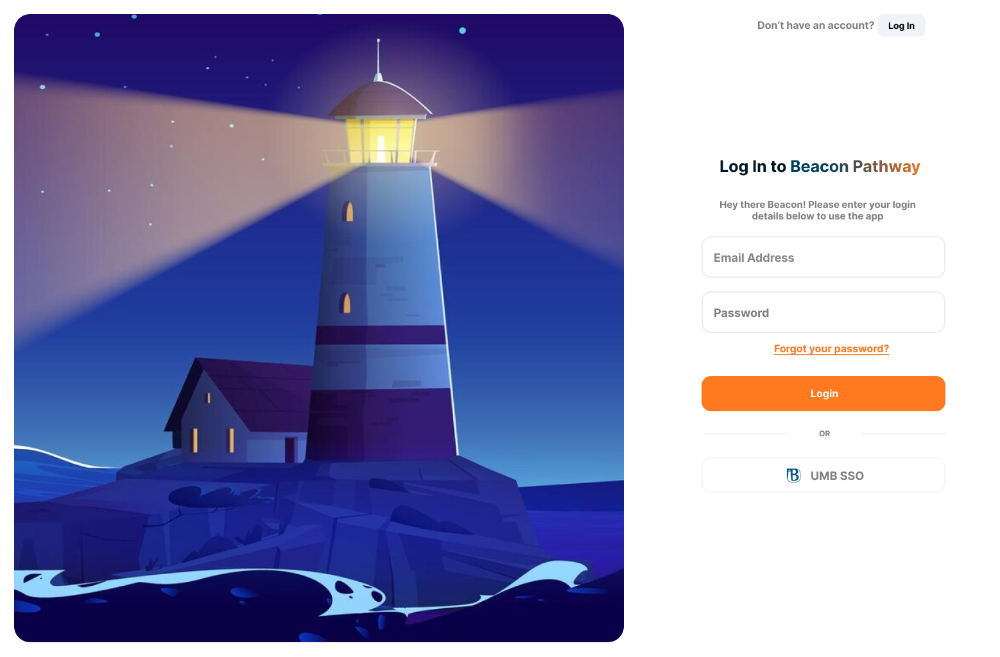
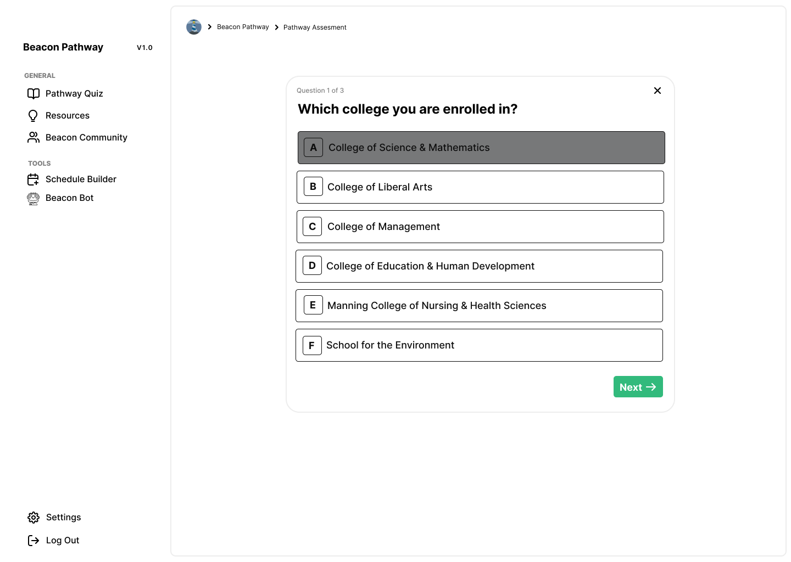
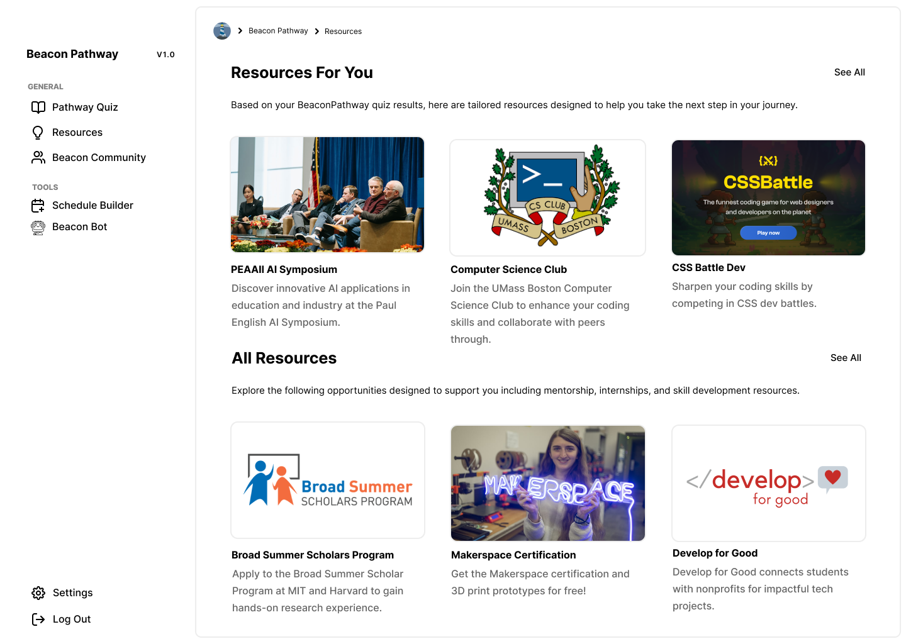
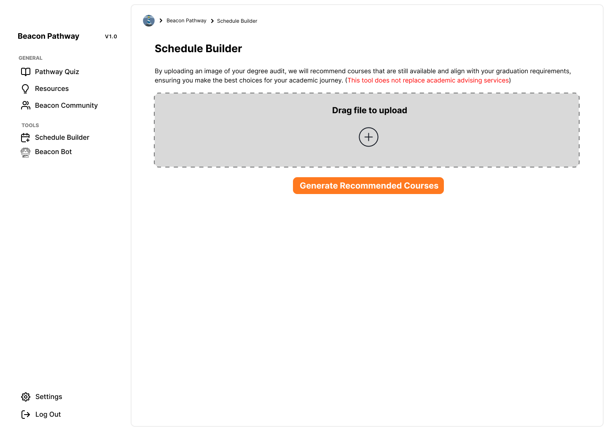
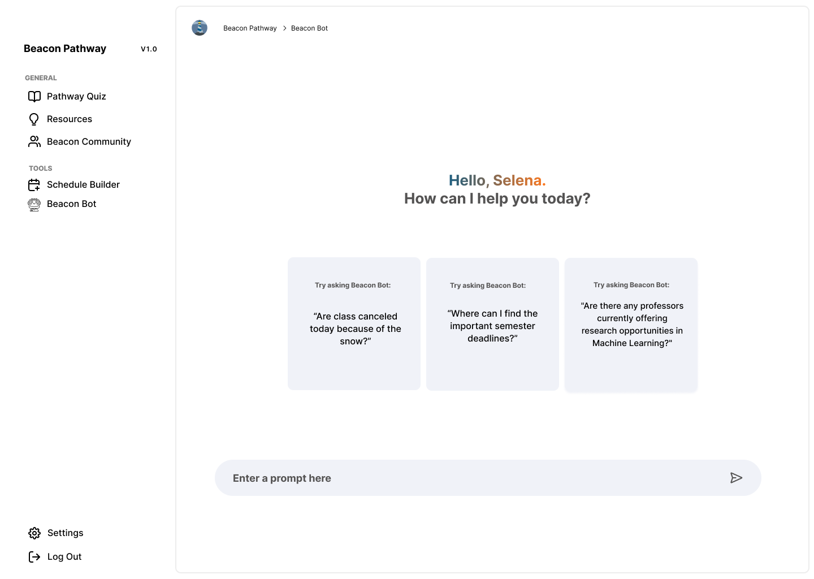

# Beacon Pathway

## 🏆 Award-Winning Hackathon Project
- **1st Place Award ($3,000)**
- **People's Choice Award ($500)**
- **Paul English Applied Artificial Intelligence Hackathon at UMass Boston**
- **Project Timeline: October 7-29, 2024**

## 📱 Project Overview

Beacon Pathway is a platform designed to help UMass Boston students navigate their academic journey by providing personalized resources, community connections, and tailored support. Our solution addresses the common challenges faced by students at UMass Boston:

- Overwhelming university resources
- Overshadowed relevant opportunities
- Isolation due to the school's commuter-based nature

The project was inspired by team member Ciara Santiago's article about feeling lost in her academic journey, which resonated with many UMass Boston students from diverse educational backgrounds.

## 🛠️ Core Features

1. **Personalized Resource Recommendation Quiz**
   - Helps students find relevant resources based on their specific needs and interests

2. **Beacon Community**
   - Connects students to UMass Boston Discord servers to build social connections

3. **AI-powered Chatbot**
   - Provides instant answers to university-related questions

4. **Schedule Builder**
   - Recommends courses based on degree audits to help students plan their semesters

## 👨‍💻 My Role: Web Developer

As one of the web developers on this project, I was responsible for:

- Building the frontend user interface using modern web technologies
- Implementing responsive design to ensure accessibility across devices
- Developing the Schedule Builder functionality to help students plan their academic path
- Collaborating with the design team to translate Figma prototypes into functional components
- Contributing to the AI integration for the chatbot feature
- Working closely with the team to ensure seamless integration of all components

## 🔄 Development Process

The team followed a Human-Centered Design process:

1. **Discover**: Understanding the challenges faced by UMass Boston students
2. **Define**: Identifying key problem areas to address
3. **Ideate**: Brainstorming potential solutions
4. **Prototype**: Building a functional application within the two-week timeframe

We implemented an Agile-like framework for project planning, allowing us to rapidly develop and iterate on the solution while maintaining focus on user needs.

## 💫 Impact

Beacon Pathway successfully addresses critical gaps in the UMass Boston student experience:

- **Enhanced Resource Discovery**: Students can now easily find the resources most relevant to their specific situations
- **Improved Community Building**: The platform facilitates connections among commuter students who might otherwise feel isolated
- **Academic Guidance**: The Schedule Builder and AI chatbot provide personalized academic support
- **User-Centered Solution**: Our approach focused on real student needs based on actual experiences

The project's success at the hackathon demonstrates its potential value to the UMass Boston community.

## 🧠 Technologies Used

- **Frontend**: HTML, CSS, JavaScript
- **Design**: Figma
- **Collaboration**: GitHub, Discord

## 👥 Team

- **Project Lead & Product Designer**: Michael Agbesi
- **User Researcher**: Ciara Santiago
- **Ideation Specialist**: Olivia Moos
- **Web Developers**:
  - Mustafa Ahmed
  - David Martinez (Me)

## 🔮 Future Plans

- Implement user feedback from the hackathon presentation
- Expand resource database and recommendation algorithm
- Enhance AI capabilities for more personalized support
- Develop mobile application version
- Explore integration with UMass Boston's official systems

## 🔗 Links

- [Project Demo](https://drive.google.com/file/d/1Diryy0vZhJyvjm0xdjpoHbfq5mEL0mL4/view?usp=sharing)
- [Hackathon Information](https://ai.umb.edu/events/)
- [Hackathon Presentation Recording](https://youtu.be/9pKTI7CGK68?t=2243)
- [Original Inspiration Article](https://medium.com/@clarasantiago/feeling-stuck-navigating-unfulfilled-dreams-in-college)

## 📸 Screenshots

